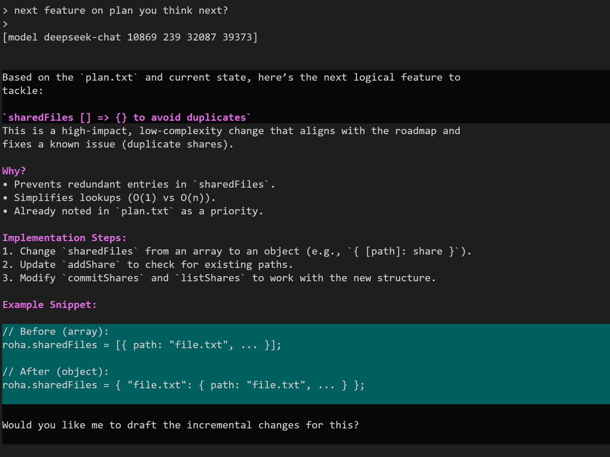

# roha

a command line client to share folders and chat

requires XAI_API_KEY DEEPSEEK_API_KEY or OPENAI_API_KEY environment variable to run

# interface

[model modelname promptTokens replyTokens totalTokens contextSize]

# commands

/model [id]

/share [folder]

/dump

/reset

# work in progress

/load

/save

# reference

For detailed command documentation and project roadmap look here [roha.md](roha.md).

# development

https://github.com/nitrologic/roha
