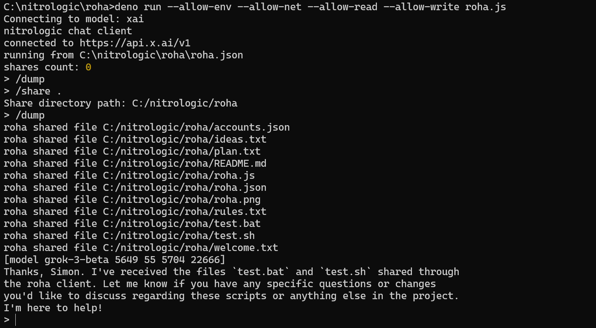

# roha

a command line client to share folders and chat

expects valid XAI_API_KEY environment variable

# interface

[model modelname promptTokens replyTokens totalTokens contextSize]

# commands

/model [id]

/share [folder]

/dump

/reset

# work in progress

/load

/save

# development

https://github.com/nitrologic/roha
